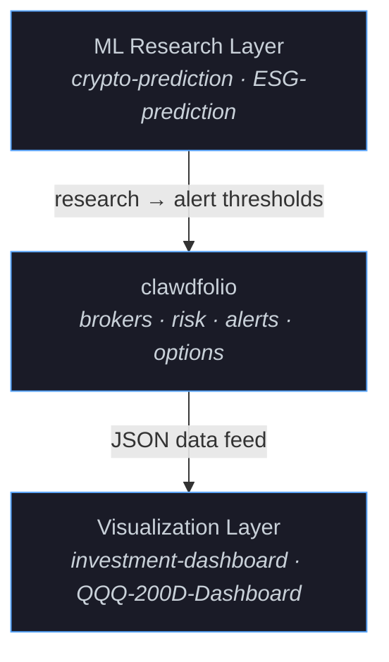
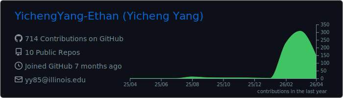

## Yicheng (Ethan) Yang

**CS & Economics @ UIUC** · Building quant tooling: multi-broker portfolio analytics, risk metrics, and interactive dashboards (Python + TS/React).

---

### Projects

| Project | What & How | Stack | Evidence |
|---------|-----------|-------|----------|
| [clawdfolio](https://github.com/YichengYang-Ethan/clawdfolio) | Quantitative portfolio toolkit — multi-broker aggregation (Longport, Moomoo), VaR/Sharpe/Beta analytics, options lifecycle management, 20+ automated workflows | Python, pandas, yfinance |   |
| [investment-dashboard](https://github.com/YichengYang-Ethan/investment-dashboard) | Interactive portfolio visualization — P&L tracking, holdings analysis, risk radar chart, dark-mode fintech UI | React, TypeScript, Recharts | [Live Demo](https://yichengyang-ethan.github.io/investment-dashboard/) · [Screenshot](https://github.com/YichengYang-Ethan/investment-dashboard/blob/main/docs/screenshot.png) |
| [QQQ-200D-Deviation-Dashboard](https://github.com/YichengYang-Ethan/QQQ-200D-Deviation-Dashboard) | Market timing tool — 200-day MA deviation with percentile ranking (0–100 index) and risk-level signals | React, TypeScript, Recharts | [Live Demo](https://yichengyang-ethan.github.io/QQQ-200D-Deviation-Dashboard/) · [Screenshot](https://github.com/YichengYang-Ethan/QQQ-200D-Deviation-Dashboard/blob/main/docs/screenshot.png) |
| [crypto-return-prediction](https://github.com/YichengYang-Ethan/crypto-return-prediction-kaggle) | 24-hour crypto return prediction — LightGBM 5-fold ensemble with time-series CV across 355 assets | Python, LightGBM, scikit-learn | HKU Web3 Quant Competition |
| [ESG-Driven-Stock-Value-Prediction](https://github.com/YichengYang-Ethan/ESG-Driven-Stock-Value-Prediction) | Stock value prediction using ESG factors — Random Forest with walk-forward backtesting over 500+ companies | Python, scikit-learn, pandas | 15% relative accuracy lift over logistic regression baseline (walk-forward CV) · Undergraduate Research |

### Architecture

### Technical Focus

- **Risk**: VaR, CVaR, Sharpe, Beta, Max Drawdown, HHI
- **Signals**: RSI, SMA/EMA, Bollinger Bands, 200-DMA deviation
- **Options**: Greeks, chain analysis, Covered Call / Sell Put lifecycle
- **ML**: LightGBM, Random Forest, time-series CV, feature engineering
- **Stack**: Python · TypeScript · React · pandas · scikit-learn · GitHub Actions

---

  

