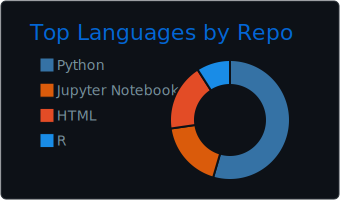
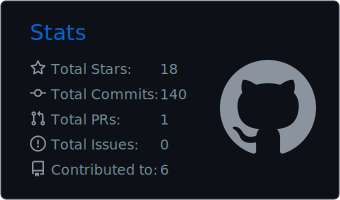
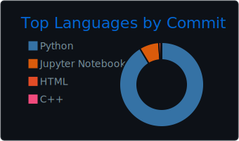
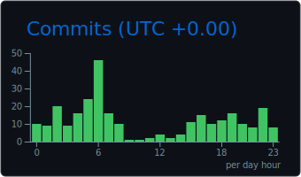

## Yicheng (Ethan) Yang

**CS & Economics @ UIUC | GPA: 4.0/4.0 | CFA Level II Candidate**

Building systematic tools for quantitative investing — risk analytics, signal generation, portfolio visualization, and ML-driven alpha research.

---

### Projects

| Project | Description | Stack | Links |
|---------|-------------|-------|-------|
| [clawdfolio](https://github.com/YichengYang-Ethan/clawdfolio) | Quantitative portfolio toolkit — multi-broker aggregation, VaR/Sharpe/Beta analytics, options lifecycle management, 20+ automated workflows | Python, pandas, yfinance | [](https://pypi.org/project/clawdfolio/) |
| [investment-dashboard](https://github.com/YichengYang-Ethan/investment-dashboard) | Interactive portfolio visualization — P&L tracking, holdings analysis, risk radar, dark-mode fintech UI | React, TypeScript, Recharts | [Live Demo](https://yichengyang-ethan.github.io/investment-dashboard/) |
| [QQQ-200D-Deviation-Dashboard](https://github.com/YichengYang-Ethan/QQQ-200D-Deviation-Dashboard) | Market timing tool — 200-day MA deviation with historical percentile ranking and risk-level signals | React, TypeScript, Recharts | [Live Demo](https://yichengyang-ethan.github.io/QQQ-200D-Deviation-Dashboard/) |
| [crypto-return-prediction](https://github.com/YichengYang-Ethan/crypto-return-prediction-kaggle) | 24-hour crypto return prediction using LightGBM ensemble and time-series CV across 355 assets | Python, LightGBM, scikit-learn | HKU Web3 Quant |
| [ESG-Driven-Stock-Value-Prediction](https://github.com/YichengYang-Ethan/ESG-Driven-Stock-Value-Prediction) | Stock value prediction using ESG factors — Random Forest with walk-forward backtesting, 15% accuracy lift | Python, scikit-learn, pandas | Undergraduate Research |

### Architecture

```
         ┌──────────────────────────┐
         │   ML Research Layer      │
         │  crypto-prediction       │
         │  ESG-prediction          │
         └────────────┬─────────────┘
                      │ research → alert thresholds
         ┌────────────▼─────────────┐
         │     clawdfolio           │
         │  brokers · risk · alerts │
         └────────────┬─────────────┘
                      │ JSON data feed
         ┌────────────▼─────────────┐
         │   Visualization Layer    │
         │  investment-dashboard    │
         │  QQQ-200D-Dashboard     │
         └──────────────────────────┘
```

### Technical Focus

- **Risk Metrics**: VaR, CVaR, Sharpe Ratio, Beta, Max Drawdown, HHI
- **Technical Analysis**: RSI, SMA/EMA, Bollinger Bands, 200-DMA deviation
- **Options**: Greeks, chain analysis, Covered Call / Sell Put lifecycle management
- **ML**: LightGBM, Random Forest, time-series CV, feature engineering
- **Stack**: Python, TypeScript, React, pandas, scikit-learn, GitHub Actions

---

<p align="center">
  
</p>
<p align="center">
  
  
</p>
<p align="center">
  
  
</p>
