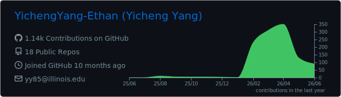
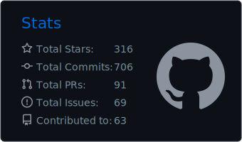
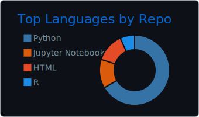

### Hey, I'm Ethan 👋

**CS & Economics @ UIUC | Quantitative Research | ML for Finance**

🔬 Building quantitative tools for systematic trading & portfolio risk management

📦 [`clawdfolio`](https://pypi.org/project/clawdfolio/) on PyPI · [Market Bubble Dashboard](https://yichengyang-ethan.github.io/Market-Bubble-Index-Dashboard/) live

📄 [Resume](./Yicheng_Yang_Resume.pdf) · [LinkedIn](https://linkedin.com/in/ethan85) · [yy85@illinois.edu](mailto:yy85@illinois.edu)

---

---

 

